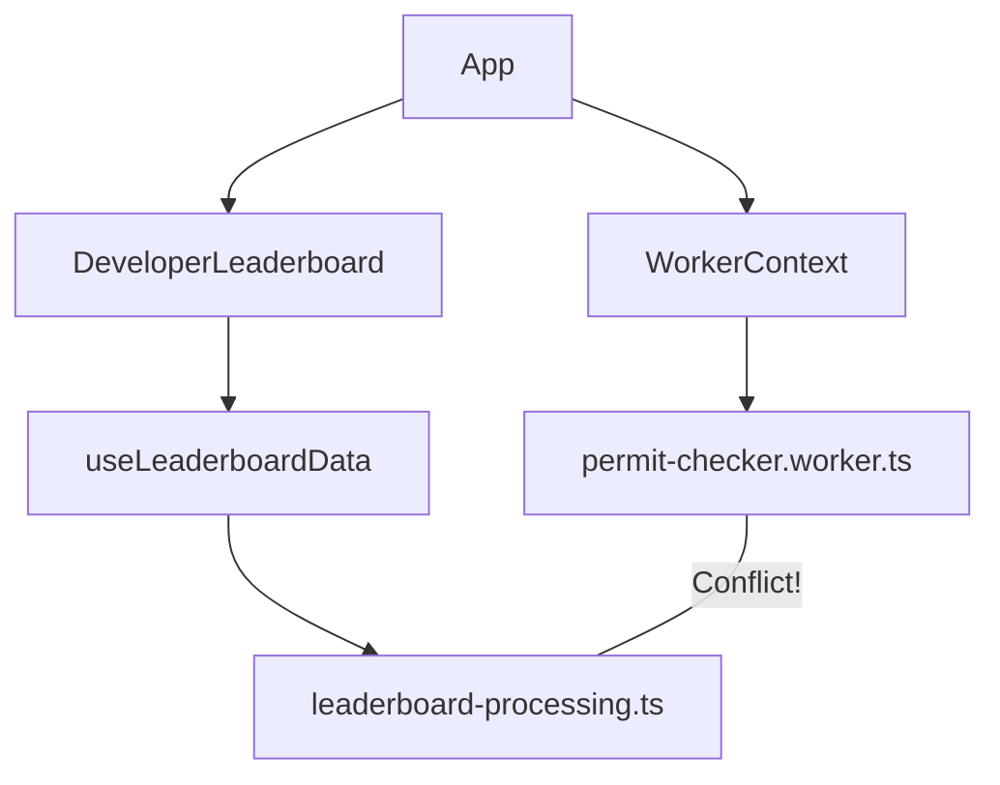
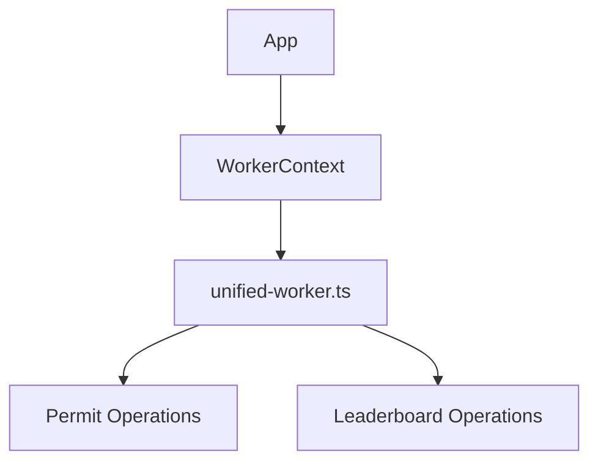
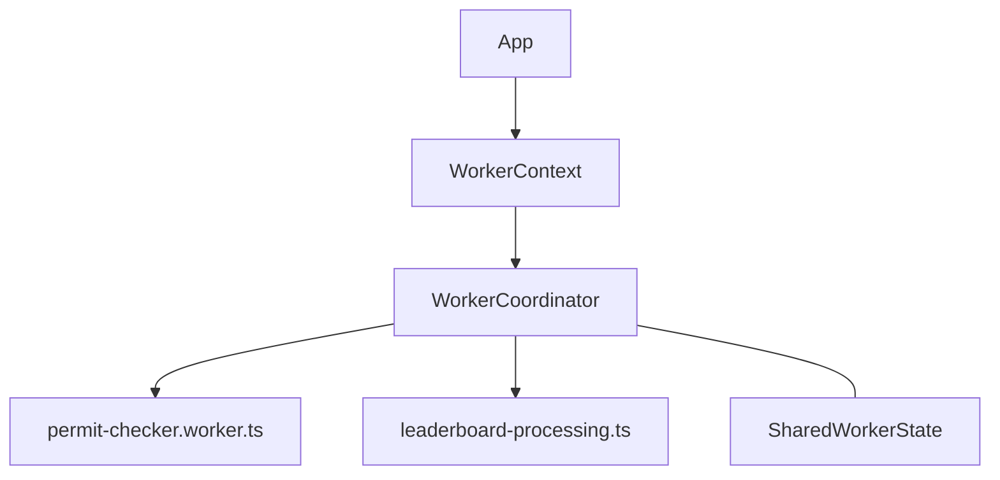
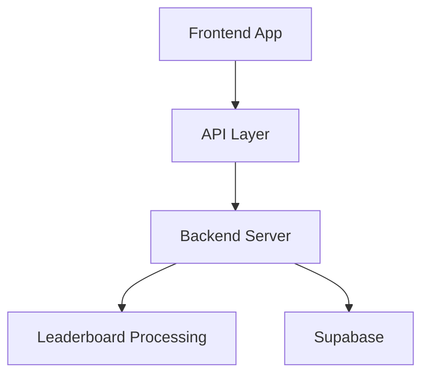

# Leaderboard Worker Conflict: Diagnosis & Resolution Plan

## Issue Summary

The developer leaderboard page is crashing with a "Worker error occurred" message when loaded. After investigation, we've determined the root cause is a web worker conflict between the global permit-checker worker and the leaderboard processing worker.

## Detailed Diagnosis

### Current Architecture



1. **Global Worker Initialization**:
   - `WorkerContext` module initializes a shared worker (`permit-checker.worker.ts`)
   - This worker is used for permit validation throughout the application
   - It's initialized when the application loads

2. **Leaderboard Worker Initialization**:
   - The leaderboard component tries to initialize its own worker (`leaderboard-processing.ts`)
   - Both workers try to access the same Supabase resources and caches
   - These workers conflict when running simultaneously

3. **Console Errors**:
   - Error logs show `WorkerContext Module: Shared worker error: JSHandle@object`
   - Worker state transitions to "error" state after initialization attempt

### Technical Limitations

1. **Browser Constraints**:
   - Browsers limit the number of workers from the same origin
   - Workers share certain resources which can lead to conflicts

2. **Supabase Connection**:
   - Both workers attempt to initialize Supabase connections
   - Potential race conditions when accessing the same database

3. **Cache Access**:
   - Both access the same IndexedDB stores, potentially causing conflicts

## Temporary Solution Implemented

To prevent application crashes and provide a better user experience, we've:

1. Replaced the leaderboard route with a maintenance message
2. Clearly communicated the issue to users
3. Created a redirection to the dashboard as an alternative

## Permanent Solution Options

### Option 1: Consolidate to a Single Worker

**Approach**: Merge leaderboard processing into the global permit-checker worker.



**Implementation Steps**:
1. Refactor `permit-checker.worker.ts` to handle additional message types
2. Move leaderboard processing logic into the shared worker
3. Create clear message interfaces for different operations
4. Update hooks to communicate with the unified worker

**Pros**:
- Eliminates worker conflicts completely
- Reduces browser resource usage
- Simplifies worker management

**Cons**:
- Increases complexity of the shared worker
- Potential performance impact if one operation blocks others
- More complex error handling

### Option 2: Worker Coordination System

**Approach**: Create a coordination mechanism that prevents multiple workers from initializing simultaneously.



**Implementation Steps**:
1. Create a `WorkerCoordinator` module to manage worker lifecycles
2. Implement a queueing system for worker operations
3. Add coordination messages to ensure only one worker accesses shared resources at a time
4. Update hooks to respect the coordination system

**Pros**:
- Maintains separate worker concerns
- More flexible for future additions
- Better isolation of errors

**Cons**:
- More complex architecture
- Higher implementation effort
- Potential for deadlocks or race conditions

### Option 3: Server-Side Processing

**Approach**: Move leaderboard data processing to the server side.



**Implementation Steps**:
1. Create server endpoints for leaderboard data processing
2. Move aggregation logic to the server
3. Update frontend to fetch pre-processed data
4. Implement appropriate caching strategies on the server

**Pros**:
- Eliminates worker conflicts completely
- Reduces client-side processing burden
- Simplifies frontend implementation

**Cons**:
- Requires server infrastructure
- Increases API complexity
- Potentially higher hosting costs

## Recommended Approach

**Option 1: Consolidate to a Single Worker** is recommended as the most efficient solution that balances implementation effort with long-term maintainability.

## Detailed Implementation Plan

### Phase 1: Preparation (1-2 days)

1. **Audit Current Worker Usage**:
   - Document all permit-checker worker operations
   - Map data flow and dependencies
   - Identify shared resources between workers

2. **Create Unified Message Interface**:
   ```typescript
   // Example unified message type
   type UnifiedWorkerMessage =
     | { type: "INIT_SUPABASE"; payload: SupabaseCredentials }
     | { type: "VALIDATE_PERMIT"; payload: PermitData }
     | { type: "FETCH_LEADERBOARD"; payload: LeaderboardOptions };
   ```

3. **Design Worker Architecture**:
   - Create handler registry for different message types
   - Design state management within the worker
   - Plan error handling strategy

### Phase 2: Implementation (2-3 days)

1. **Refactor Shared Worker**:
   - Expand `permit-checker.worker.ts` to include leaderboard functionality
   - Implement message routing system
   - Add resource management to prevent conflicts

2. **Migrate Leaderboard Logic**:
   - Move core processing functions from leaderboard worker
   - Adapt caching strategy for unified approach
   - Ensure backward compatibility with existing code

3. **Update Hook Implementation**:
   ```typescript
   // Example updated hook
   export function useLeaderboardData({ selectedWeeks }: UseLeaderboardDataProps) {
     // Use shared worker context instead of creating new worker
     const { worker } = useWorker();

     const fetchData = useCallback(async () => {
       // Communication with unified worker
       worker.postMessage({
         type: "FETCH_LEADERBOARD",
         payload: { selectedWeeks }
       });
     }, [worker, selectedWeeks]);

     // Rest of implementation...
   }
   ```

### Phase 3: Testing & Validation (1-2 days)

1. **Unit Tests**:
   - Create tests for individual worker message handlers
   - Validate data processing functions

2. **Integration Tests**:
   - Test worker communication flow
   - Verify caching behavior
   - Validate edge cases (disconnections, errors)

3. **Performance Benchmarking**:
   - Measure loading times for leaderboard data
   - Compare memory usage before and after changes
   - Monitor IndexedDB access patterns

### Phase 4: Deployment & Monitoring (1 day)

1. **Phased Rollout**:
   - Deploy unified worker implementation
   - Enable feature for subset of users first
   - Monitor error rates

2. **Fallback Strategy**:
   - Implement circuit breaker pattern
   - Create graceful degradation for failures

3. **Documentation**:
   - Update technical documentation
   - Document architectural changes
   - Create developer guide for future worker changes

## Timeline

- **Total Estimated Time**: 5-8 days
- **Critical Path**: Unified message interface → Worker refactoring → Hook updates
- **Dependencies**: Supabase SDK, IndexedDB access

## Future Considerations

1. **Worker Modularization**:
   - Consider breaking down worker into feature-specific modules
   - Implement on-demand loading of worker functionality

2. **Offline Support**:
   - Enhance caching for offline leaderboard viewing
   - Implement background sync for changes

3. **Performance Optimizations**:
   - Investigate partial data loading strategies
   - Consider virtualization for large leaderboards
   - Implement progressive enhancement approaches
